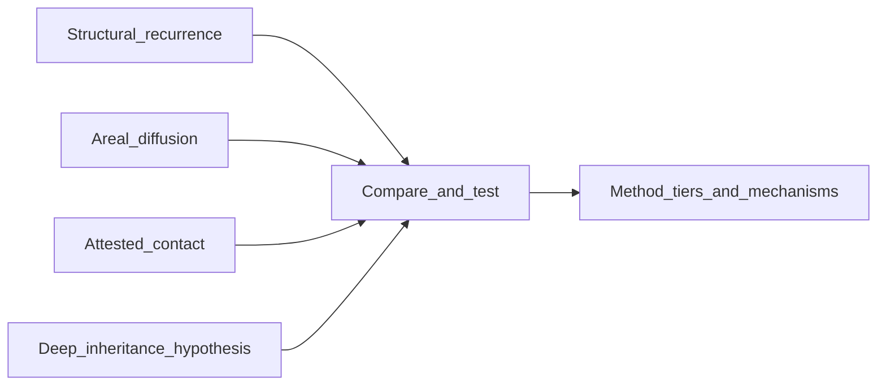

# Exploring transmission and deep narrative patterns

This page states the site's positive program: how it searches for real connections among messianic and mediator traditions, rather than either dismissing every parallel or treating similarity as automatic proof of borrowing. The question is where genuine connection might lie — among structural resemblance, regional diffusion, documented imperial contact, manuscript networks, and deeper linguistic or narrative inheritance. Every serious claim needs a mechanism and a falsifier; that constraint is what distinguishes exploration from speculation.

## Thesis of exploration

Messianic, mediator, hero, and cosmic-renewal narratives across Eurasia are **empirical questions**. Overlap between traditions might be:

1. **Structural** — recurrent narrative roles (rescuer, underworld journey, dying-and-rising idiom) without shared historical origin.
2. **Areal** — neighboring cultures sharing motifs through proximity and bilingual milieux, short of provable literary dependence.
3. **Attested contact** — empire, army, trade cities, translation, and cult institutions moving **titles, art, and texts** on datable horizons.
4. **Deeper inheritance** — comparative IE or West Asian **reconstructions** (PIE narrative slots, royal myth templates), always **hypothesis-heavy** and checked against philology and archaeology.

Each serious claim needs a **mechanism** (how it could have traveled) and **what would falsify or weaken** it. That is **exploration with rules**, not caution for its own sake.

## Mechanisms (how connection could work)

- **Oral epic and performance** — stable story slots across languages and dialects.
- **Imperial administration and army** — movement of personnel, cult, and vocabulary (see [Emperor cult and civic *sōtēr*](emperor-cult-and-civic-soter.md), [Philippi / Via Egnatia](philippi-via-egnatia-religious-milieu.md)).
- **Urban pluralism** — synagogues, temples, and mystery guilds in the same cities.
- **Literacy and bilingual texts** — translation, scripture, epithets on stone.
- **Trade and pilgrimage corridors** — long-distance contact without single “conspiracy.”
- **Royal and civic mythmaking** — founders, saviors, and ancestors **retold** after the fact (hero cult, hagiography).

## What strengthens or weakens a transmission claim

| Stronger (when present) | Weaker (when absent or negative) |
| --- | --- |
| Dated **bilingual** or **translation** context | Only **motif** overlap, no plausible **channel** |
| **Onomastics** or **loanword** arguments with philological debate | **Sound-alike** etymologies without regular correspondences |
| **Archaeological** or **art-historical** horizon (e.g. iconographic spread) | Forced **chronology** (effect before cause) |
| **Institutional** continuity (cult, court, chancellery) | **Cherry-picked** episodes from unrelated genres |
| Named **specialist** literature arguing **contact** | Popular parallel lists without sources |

For a worked **method** for name vs. motif vs. contact evidence, see [Measuring influence: Mitra, Mithra, Maitreya](measuring-influence-mitra-maitreya.md).

## Layers of explanation (diagram)

“Deep inheritance” (e.g. broad **PIE** or **West Asian** narrative templates) is **not** the same as **documented** historical transmission of a specific cult text—it is a **hypothesis tier** that still requires **independent** arguments.

## Where this site already explores connections

- **Iranian–Jewish–Christian milieux:** [Evidence leads — Persian milieu and Mitra cluster](evidence-leads-persian-milieu-and-mitra-cluster.md), [Saoshyant and cross-tradition influence](saoshyant-influence-hypotheses.md), [Achaemenid empire and West Asian Judaism](achaemenid-and-west-asian-judaism.md), [Persian loanwords in Biblical Hebrew/Aramaic](persian-loanwords-in-biblical-tradition.md), [Eschatological vocabulary timeline](eschatological-vocabulary-timeline.md), [Dead Sea Scrolls dualism](dead-sea-scrolls-dualism-and-iranian-parallels.md), [Jewish angelology and yazata parallels](jewish-angelology-and-yazata-parallels.md), [The Parthian corridor](parthian-arsacid-corridor.md), [Gnosticism and Mandaeanism](gnosticism-and-mandaeanism.md).
- **Buddhist and Central Asian horizons:** [Gandhara, Mahayana, and Central Asian transmission](gandhara-central-asian-transmission.md).
- **Mitra–Mithra–Maitreya:** [Measuring influence](measuring-influence-mitra-maitreya.md); [Mithra cluster hub](../mithras.md).
- **PIE, folktale indexes, hero cult:** [PIE motifs, ATU / Thompson, and hero traditions](pie-motifs-atu-thompson-and-hero-traditions.md); [Two brothers, divine twins, and fraternal archetypes](pie-twin-and-brother-archetypes.md); [PIE and ANE traces in the Bible](pie-and-ane-traces-in-biblical-tradition.md).
- **Mediterranean civic and mystery milieux:** [Hero cults and mystery cults — Mediterranean atlas](hero-cult-and-mystery-cult-atlas.md).

## See also

- [Method: evidence, influence, and milieu](method-evidence-and-influence.md) — guardrails for **how** we argue
- [Messianic archetypes](messianic-archetypes.md)
- [Eurasian mediator figures assessment](eurasian-mediator-figures-assessment.md)
- [Further reading](further-reading.md)
